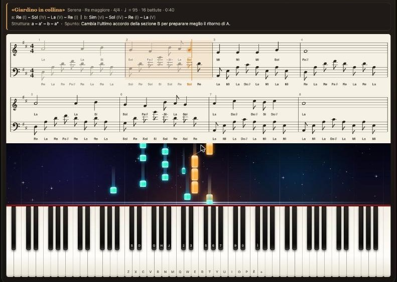

# 🎹 PlayPiano

Pianoforte virtuale a 88 tasti per suonare, leggere spartiti, imparare brani e inventare musica.
Funziona nel browser e come app desktop per macOS, Windows e Linux.

**Provalo online:** https://melody.djluza.com/

Sviluppato da **[luzadev](https://github.com/luzadev)**.

🎬 **Video di presentazione:** [guarda il Reel](docs/playpiano-reel.mp4) (27 secondi, formato verticale).

📖 **Guida all'uso:** [melody.djluza.com/guida.html](https://melody.djluza.com/guida.html), disponibile anche dentro l'app con il link «Guida».

## Cosa fa

- **Pianoforte a coda campionato** su tutti gli 88 tasti, da La0 a Do8, con registrazioni di uno Yamaha C5. Sono disponibili anche piano elettrico, organo, synth e archi.
- **Tanti modi di suonare**: mouse, touch con più dita, tastiera del computer e tastiera MIDI. Pedale sustain, glissando e dinamica in base al punto in cui premi il tasto.
- **Spartiti**: carica file MIDI (`.mid`) e MusicXML (`.musicxml`, `.xml`, `.mxl`), anche trascinandoli sulla pagina.
- **Pentagramma** in chiave di violino e di basso, due righe per volta, con i nomi delle note (Do Re Mi oppure C D E).
- **Cascata di note "spaziale"** che scende verso la tastiera e illumina il tasto da suonare.
- **Modalità Apprendimento**: il brano avanza solo quando suoni la nota giusta. Puoi studiare una mano alla volta, rallentare fino al 25% e vedere il punteggio di precisione.
- **Compositore di idee**: genera brani da 8 a 128 battute in sei stili, con tonalità, accordi, melodia e accompagnamento.
- **Generatore di accordi**: 18 tipi di accordo con rivolti e 13 giri classici (pop, jazz, blues, canone di Pachelbel, andalusa e altri) in tutte le tonalità.
- **Idee con IA locale**: descrivi a parole il brano che vorresti e un modello di [Ollama](https://ollama.com) sul tuo computer ne progetta la struttura.
- **Registratore** ed **esportazione in MIDI** di qualsiasi brano caricato o generato.

## Comandi da tastiera

| Tasti | Funzione |
|---|---|
| `Z` `X` `C` `V` `B` `N` `M` con `S` `D` `G` `H` `J` | ottava bassa, tasti bianchi e neri |
| `Q` `W` `E` `R` `T` `Y` `U` `I` `O` `P` con `2` `3` `5` `6` `7` `9` `0` | ottava alta, tasti bianchi e neri |
| `←` `→` | cambia ottava |
| `Spazio` | pedale sustain |
| `Invio` | avvia o mette in pausa il brano |
| `Maiusc` + tasto | nota più forte |

Le etichette sui tasti si adattano al layout della tua tastiera, italiana compresa.

## Come usarlo

### Online
Apri https://melody.djluza.com/ con Chrome, Edge, Firefox o Safari.

### Sul tuo computer, nel browser
Su macOS fai doppio clic su `Avvia PlayPiano.command`. Avvia un piccolo server locale e apre l'app su
`http://localhost:8765`. Su altri sistemi, dalla cartella del progetto:

    python3 -m http.server 8765 --bind 127.0.0.1

Aprire direttamente `index.html` con un doppio clic funziona, ma con due limiti: i campioni del pianoforte
vengono scaricati da internet e Ollama rifiuta le richieste della pagina.

### App desktop
Scarica il pacchetto per il tuo sistema dalla pagina [Actions](../../actions) (sezione Artifacts dell'ultima
compilazione riuscita) oppure dalle [Release](../../releases), se presenti.

I pacchetti non sono firmati con un certificato a pagamento. Al primo avvio su macOS usa clic destro e poi
"Apri". Su Windows scegli "Ulteriori informazioni" e poi "Esegui comunque".

## Idee con IA locale (Ollama)

1. Installa e avvia [Ollama](https://ollama.com), poi scarica un modello, per esempio `ollama pull gemma3:12b`.
2. Nell'app scrivi la descrizione del brano, scegli il modello e premi "Genera con IA".

Il modello decide titolo, stile, tonalità, metrica, tempo, accordi e il motivo melodico di ogni sezione.
Ogni valore viene verificato dall'app, che completa melodia e accompagnamento.

Vanno bene i modelli "instruct" da circa 8 miliardi di parametri in su. Provati: `gemma3:12b` e `gemma4:26b`.

Ollama accetta richieste solo da pagine servite su `localhost` e dall'app desktop. Per usare l'IA dal sito
online, avvia Ollama consentendo il sito:

    OLLAMA_ORIGINS=https://melody.djluza.com ollama serve

## Sviluppo

Tutta l'app è nel file `index.html`, senza dipendenze né passaggi di compilazione.

| Percorso | Contenuto |
|---|---|
| `index.html` | l'intera applicazione web |
| `guida.html`, `guida-img/` | guida all'uso con le sue immagini |
| `samples/` | campioni del pianoforte, un mp3 ogni terza minore |
| `esempi/` | brani di prova in formato MIDI, MusicXML e MXL |
| `desktop/` | contenitore Electron e icona |
| `.github/workflows/build.yml` | compilazione dei pacchetti desktop su GitHub |
| `video/` | sorgenti Remotion del video di presentazione |

### App desktop in locale
Serve Node.js 20 o superiore.

    npm install        # solo la prima volta
    npm start          # avvia l'app desktop
    npm run dist:mac   # crea i file .dmg nella cartella dist/

Da un Mac con chip Apple si ottengono anche le versioni portatili:

    npx electron-builder --win zip --x64
    npx electron-builder --linux tar.gz --x64

L'installer per Windows e l'AppImage per Linux vengono compilati da GitHub Actions. Il flusso si avvia a mano
dalla pagina Actions, oppure pubblicando un tag di versione, che crea anche una Release con i pacchetti:

    git tag v1.0.1 && git push origin v1.0.1

### Pubblicazione del sito
Il sito è composto da soli file statici:

    rsync -az index.html guida.html guida-img samples esempi utente@server:public_html/

## Limiti noti

- Gli spartiti in PDF o in foto non sono supportati: servono MIDI o MusicXML.
- Sul pentagramma non vengono disegnate pause, legature di valore e travature.
- Nei file MIDI le durate scritte sono dedotte dall'esecuzione, quindi possono risultare approssimate.
- I ritornelli dei file MusicXML non vengono ripetuti.

## Crediti e licenze

- Il codice di PlayPiano è distribuito con licenza [MIT](LICENSE).
- Sviluppo e progetto: [luzadev](https://github.com/luzadev).
- Campioni di pianoforte: [Salamander Grand Piano](https://archive.org/details/SalamanderGrandPianoV3) di Alexander Holm, licenza CC-BY 3.0.
- App desktop realizzata con [Electron](https://www.electronjs.org).
- Video di presentazione realizzato con [Remotion](https://www.remotion.dev): i sorgenti sono nella cartella `video/`.

I campioni del pianoforte nella cartella `samples/` non sono coperti dalla licenza MIT: restano sotto la loro licenza CC-BY 3.0.
